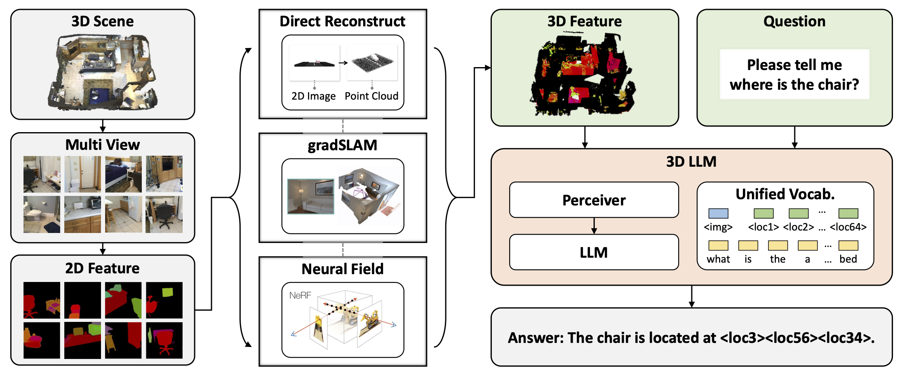

<br />
<p align="center">
  <h1 align="center">3D-LLM: Injecting the 3D World into Large Language Models</h1>

  <p align="center">
    <a href='https://arxiv.org/abs/2307.12981'>
      
    </a>
    <a href='https://vis-www.cs.umass.edu/3dllm/' style='padding-left: 0.5rem;'>
      
    </a>
  </p>
  <p align="center">
    
  </p>
</p>

## Three-step 3D Feature Extraction
TODO.

## 3D-LLM_BLIP2-based
### Installation

Install [salesforce-lavis](https://github.com/salesforce/LAVIS)

```shell
$ conda create -n lavis python=3.8
$ conda activate lavis

$ git clone https://github.com/salesforce/LAVIS.git SalesForce-LAVIS
$ cd SalesForce-LAVIS
$ pip install -e .

$ pip install positional_encodings
```

### Training

```shell
$ cd 3DLLM_BLIP2-base

$ conda activate lavis
# use facebook/opt-2.7b:
$ python -m torch.distributed.run --nproc_per_node=8 train.py --cfg-path lavis/projects/blip2/train/3dvqa_ft.yaml
# use flant5
$ python -m torch.distributed.run --nproc_per_node=8 train.py --cfg-path lavis/projects/blip2/train/3dvqa_flant5_ft.yaml
```


## Citation

If you find our work useful, please consider citing:

```
@article{3dllm,
 author = {Hong, Yining and Zhen, Haoyu and Chen, Peihao and Zheng, Shuhong and Du, Yilun and Chen, Zhenfang and Gan, Chuang},
 title = {3D-LLM: Injecting the 3D World into Large Language Models},
 journal = {arXiv},
 year = {2023},
} 
```

### Acknowledgements

https://github.com/salesforce/LAVIS

https://github.com/mlfoundations/open_flamingo
